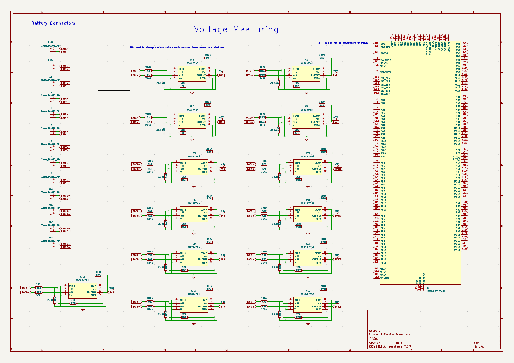

# State of Charge Estimation for Battery Cells

## Schematics

System to read individual voltage from 13s4p battery cell configuration. 
A differential amplifier, [INA 117](https://www.ti.com/product/INA117), was used to read the voltage. The output was then fed into an STM32 device to read and do calculations on the data.

## STM32 Embedded

This system assumes muxes are present in the circuit schematic. It chooses sends a signal to mux select lines in order to get a reading. This configuration can be connected to cycle through all mux inputs and read data continuously.

The ADC is used to convert the analog signals to digital and store the values for calculations.

Mux and ADC design is in [`stm32/Core/src/main.c`](stm32/Core/src/main.c)
IOC file visualizes what pins are connected to input and output.

